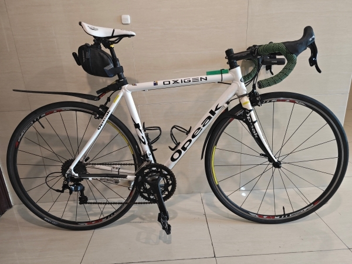
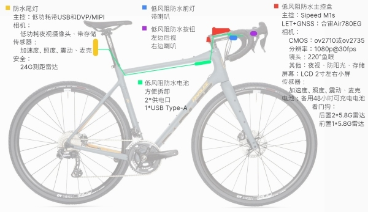

## 1. 简介

减少自组自行车的试错成本，并介绍一些好用的装备，以及一些技巧。

## 2. 通勤公路车

自组通勤公路自行车，兼顾休闲骑行和业余比赛。

三款都是减震座管，可以做到不穿骑行裤也能长距离骑行。

三款用的都是圈刹，相比碟刹有好维护、重量轻、便宜、制动力强、辐条受力均匀等优点，并且都配置了全天候刹车皮，以减少雨天刹车性能下降问题，不走泥路越野，刹车能力完全不用担心。

**2.1. 基础款**

￥2200左右，8.8kg轻量化车身。

[链接](https://gitee.com/kukela/commuter-bike/blob/master/RoadBike/基础通勤.md)

**2.2. 进阶款**

￥3300左右，8.2kg入门气动超轻车身。

[链接](https://gitee.com/kukela/commuter-bike/blob/master/RoadBike/进阶通勤.md)

**2.3. 青春款**

￥1600左右，10kg实用车身。

[链接](https://gitee.com/kukela/commuter-bike/blob/master/RoadBike/青春通勤.md)

## 3. 配件、工具及技巧

1. [车身配件](https://gitee.com/kukela/commuter-bike/blob/master/Doc/车身配件.md)

2. [人身装备](https://gitee.com/kukela/commuter-bike/blob/master/Doc/人身装备.md)

3. [装车洗车保养...工具](https://gitee.com/kukela/commuter-bike/blob/master/Doc/工具.md)

4. [技巧](https://gitee.com/kukela/commuter-bike/blob/master/Doc/技巧.md)、[胎压参考计算器](https://kukela.gitee.io/commuter-bike/tirePressureCalc.html)、[传动速度计算器](https://kukela.gitee.io/commuter-bike/gearCalc.html)

5. [轮组](https://gitee.com/kukela/commuter-bike/blob/master/Doc/轮组.md)

## 4. Diy配件

1. 通勤智能套件（正在开发中）

   

2. 破风挡泥板（正在开发中）

   [示例图]